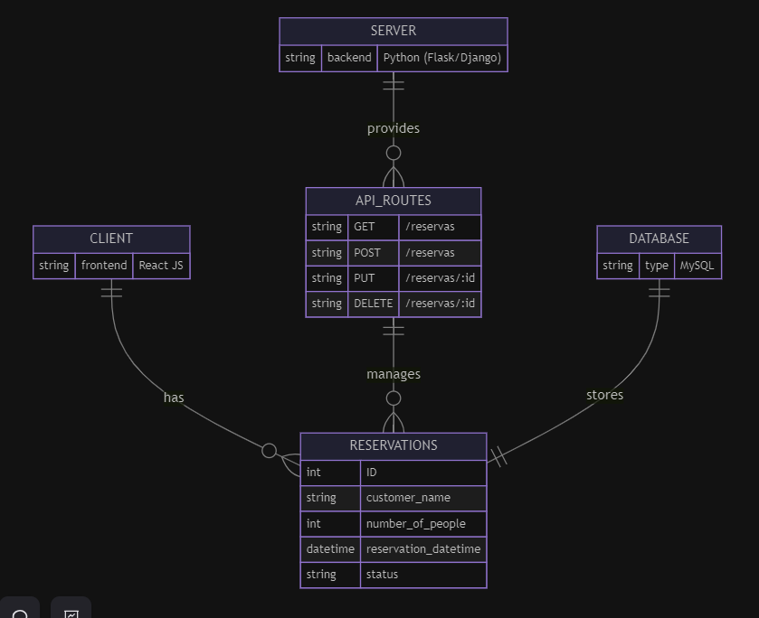

# Restaurant Reservation Frontend

## Arquitectuta de Software del Sistema de Reservas



# Estructura del Proyecto

- src
  - App.tsx
  - index.css
  - main.tsx
  - vite-env.d.ts
  - assets
    - react.svg
  - components
    - ReservationForm.tsx
    - ReservationTable.tsx
  - constants
    - services.ts
  - services
    - reservation.services.ts
    - types.ts

## Ejecución del Proyecto

1. **Instalación de Dependencias**

   - Asegúrrse de tener Node.js y Yarn instalados en el sistema. Luego, desde la raíz del proyecto, ejecutar el siguiente comando para instalar las dependencias:
     ```
     yarn
     ```

2. **Ejecución del Backend**

   - Antes de ejecutar el frontend, asegúrate de que el backend esté corriendo y funcione correctamente.

3. **Ejecución del Frontend**
   - Una vez que el backend esté en funcionamiento, se puede iniciar el frontend utilizando el siguiente comando:
     ```
     yarn run dev
     ```
     Este comando compilará el proyecto y lo ejecutará en un servidor local. Después de que se complete la compilación, se podrá acceder al frontend a través del navegador web en la dirección `http://localhost:5173` (o en otro puerto si se especifica).

# ¡Muchas Gracias!
